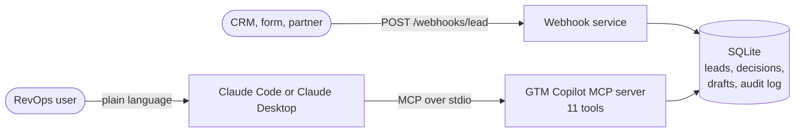

# GTM Copilot MCP

**Work with your revenue stack through Claude, safely.**

A pilot MCP server for RevOps. Ask Claude to audit email deliverability, route and explain inbound leads, draft outreach with an AI SDR that cannot go off-script, and compare build, buy and hybrid costs per meeting.

Built as a worked example for the Senior GTM Engineer role at Krisp. **All data is synthetic and nothing is ever sent.**

---

## How you use it

**There is no web interface.** You talk to Claude in plain language, and Claude calls the tools this server exposes. A second, small HTTP endpoint lets a CRM or web form post leads in.



| Entry point | Used by | How |
|---|---|---|
| **MCP server** (stdio) | People, through Claude | Register once, then ask in plain language |
| **Webhook** (HTTP, `POST /webhooks/lead`) | Systems: CRM, forms, partners | Shared secret header and a JSON body |

For example, you ask *"Why did lead 4 go to mid-market and not enterprise?"*, and Claude calls `explain_lead` and answers from what it returns:

```
Lead at brightpath.example (BrightPath Consulting, 300 employees) -> Mid-market AE
Score: 35/100
  +15 fit_size_midmarket: Mid-market company (100-999 employees) (300 employees)
  +5  fit_country_priority: Priority market (AU)
  +10 persona_manager: Manager-level title (title matched: manager)
  +5  intent_content: Downloaded content (source: content_download)
Route: Matched 'midmarket': 300 employees >= 100. Skipped earlier rules: ...
       enterprise (300 employees < 1000; score 35 < 60).
```

The answer is the decision **as it was stored when the lead arrived**, with the rule trace, not a recomputation.

## What it does

| Tool | What it does | Addresses |
|---|---|---|
| `audit_domain` | Checks SPF, DKIM and DMARC over public DNS; scores 0 to 100 with prioritized fixes | Email infrastructure and deliverability |
| `route_lead` | Enriches, scores and routes a lead; explains every rule that fired | GTM architecture: routing, enrichment, scoring |
| `explain_lead` | Returns the stored decision and rule trace for a lead | Explainable automation |
| `list_leads` | Lists recent leads with masked emails | Working with the CRM through Claude |
| `draft_email` | Drafts a first email from **approved facts only**, runs eight guardrails, queues it for review | AI SDRs with guardrails |
| `get_draft`, `list_drafts` | Read drafts, their guardrail reports and content hashes | Human review |
| `approve_draft`, `reject_draft` | Approve with the exact reviewed hash, or reject with a reason. **Sends nothing** | Human in the loop |
| `estimate_cost_per_meeting` | Compares build, buy and hybrid by cost per meeting, with crossovers and sensitivity | Build vs buy vs hybrid recommendation |
| `ping` | Health check | |

Behind them: a webhook that authenticates, validates and de-duplicates inbound leads, a SQLite stand-in CRM, and an append-only audit log.

## Safe by design

Drafting emails from data that strangers control is the classic setting for prompt injection, so the system assumes the model will sometimes be fooled and makes sure that does not matter. **The model proposes, code checks, a human decides.**

- **The model has no tools.** The worst an injected instruction can do is change the text of a draft.
- **Lead text is untrusted.** Instruction-like messages, titles and names are withheld from the model; everything else is truncated and fenced in an untrusted block.
- **Eight guardrails run on the model's output**, in code: only approved facts, no links or addresses, no invented numbers, certifications or track record, no leaked internal ids, length, and a footer that code (not the model) appends.
- **Drafts are immutable**, enforced by database triggers. A blocked draft can never be approved, and approval requires the exact content hash that was reviewed.
- **Opted-out contacts are never drafted.** Suppression, queue and rate limits are checked before the model is called.
- **Nothing is sent.** There is no email transport in the codebase.

A drafter scripted to obey an injection is blocked by the guardrails alone, and in live runs against two real local models, **0 of 6 drafts written for leads that carried an injection payload obeyed it**. The same live runs also exposed two guardrail gaps the tests had missed, now fixed. The limits (what pattern checks cannot catch) are stated in the open: see **[docs/safety.md](docs/safety.md)**.

## Quickstart

**Requirements:** Node 22.5 or newer. No API key. A local model (LM Studio) is optional.

```bash
git clone https://github.com/hhovhann/gtm-copilot-mcp.git
cd gtm-copilot-mcp
npm ci
npm test            # 342 tests, no network, no model needed
```

**1. Register the server with Claude Code** (once, from the repo root):

```bash
claude mcp add gtm-copilot -s user -e SDR_DRAFTER=template -- "$PWD/node_modules/.bin/tsx" "$PWD/src/index.ts"
```

Absolute paths are used on purpose: the client starts the server from whatever directory you are in. `SDR_DRAFTER=template` drafts offline with no model. To draft with a local model instead, start LM Studio's server (`lms server start`) and use `-e SDR_DRAFTER=local`. Start a new Claude Code session afterwards so it loads the server.

**2. Start the webhook and load demo leads** (two terminals):

```bash
export WEBHOOK_SECRET=demo-secret-local-0123456789
npm run webhook                    # terminal A
./scripts/seed-demo-leads.sh       # terminal B: nine synthetic leads
```

**3. Ask Claude:**

1. *Audit the email authentication for github.com.*
2. *List the latest leads.*
3. *Explain lead 4. Why mid-market and not enterprise?*
4. *Draft an email for lead 1.* Then *lead 6* (disqualified), *lead 8* (suppressed) and *lead 9* (carries an injection attempt).
5. *Approve draft 1.* Claude Code asks for permission; **do not choose "always allow" for `approve_draft`**.
6. *What does a meeting cost us, build vs buy?*

To remove it: `claude mcp remove gtm-copilot -s user`. Demo data lives in `data/gtm.db` (git-ignored); delete it to reset.

### What you will see

A draft the guardrails block, from a real local-model run:

```
Draft #16 for lead #12: blocked (drafter local, model meta-llama-3.1-8b-instruct)
Guardrails: blocked (8 checks)
  FAIL length: subject must be 1-80 characters and the body 80-1200 (got 50 and 10);
       a greeting alone is not an email
```

A draft where the lead's message tried to hijack the model:

```
Draft #6 for lead #10: pending_review (drafter template, model template-v1)
Guardrails: passed (9 checks)
  warn lead_message_dropped: the prospect's message looked like instructions
       and was withheld from the model
```

## Cost per meeting

`estimate_cost_per_meeting` compares three ways to run an AI SDR and shows where the money goes. Token usage and guardrail pass rate are **measured** from stored drafts; every other number is a **labeled placeholder**, not a benchmark and not Krisp's figures. With the placeholders, the three options land within about 8% of each other, human review is the largest cost (45 to 49% of build and hybrid) and the model itself is under 1%. The honest conclusion is that the decision turns on review time, volume and real vendor quotes. Replace the numbers in `config/economics.json` or pass overrides per call.

## How it was built

Spec-driven, in small phases, each with its own requirements, plan and validation checklist.

| Phase | Delivered |
|---|---|
| 1 | MCP server over stdio |
| 2 | Deliverability auditor (SPF, DKIM, DMARC) |
| 3 | Lead scoring and routing with rule-level explanations |
| 4 | Webhook intake, SQLite CRM, append-only audit log |
| 5 | AI SDR drafter, guardrails, approval queue (local model first) |
| 5b | Cost per meeting: build vs buy vs hybrid |

The constitution is in [`specs/`](specs/): [mission](specs/mission.md), [tech stack](specs/tech-stack.md) and [roadmap](specs/roadmap.md), including a replanning log. Each phase folder holds `requirements.md`, `plan.md` and `validation.md`; checklists were ticked only after a check was run, and real findings are recorded in them, including the mistakes. 342 automated tests run with no network, and the security-relevant code was mutation-tested.

## Configuration

| Variable | Default | Purpose |
|---|---|---|
| `WEBHOOK_SECRET` | none, required | Shared secret for the webhook (16 characters or more) |
| `GTM_DB_PATH` | `data/gtm.db` in the repo | SQLite file shared by both processes |
| `HOST`, `PORT` | `127.0.0.1`, `3000` | Webhook bind address |
| `SDR_DRAFTER` | `local` | `local` (LM Studio), `template` (offline). `anthropic` is reserved for Phase 5c |
| `SDR_LOCAL_BASE_URL`, `SDR_LOCAL_MODEL` | `http://127.0.0.1:1234/v1`, `meta-llama-3.1-8b-instruct` | Local model endpoint and name |
| `SDR_ALLOW_REMOTE_LLM` | unset | Set to `1` only to send lead data to a non-loopback model server |

| File | Controls |
|---|---|
| `config/routing.json` | Scoring rules, routing order, free-mail and blocked domains |
| `config/sdr.json` | Draftable queues, limits, injection patterns, forbidden phrases, footer, production model price |
| `config/economics.json` | Cost model placeholders (every block tagged as an assumption) |
| `data/approved-facts.json` | The only product statements the model may use |
| `data/suppression.json` | Emails and domains that are never drafted |
| `data/companies.json` | Synthetic enrichment data |

## Limitations and next steps

- **Integrations are mocked.** HubSpot, Salesforce, Clay and Gong are represented by interfaces (`Enricher`, `Drafter`, `DnsResolver`) and a SQLite stand-in; real connectors are the obvious next build.
- **Claude as the drafter** (Phase 5c, `claude-sonnet-5-5`) is planned. Local-model results here describe two small models and must not be read as Claude's quality.
- **Deliverability gate on approval:** block approval when the sender domain fails `audit_domain`.
- **Production hardening:** HMAC webhook signatures, rate limiting, TLS, a documented data-erasure path, and real approved messaging in place of the pilot placeholders.

See [docs/safety.md](docs/safety.md) for the full threat model and what is deliberately not protected.

## Repository layout

```
src/index.ts, src/server.ts     MCP server entry and tool registration
src/webhook.ts, src/webhook/    Webhook service
src/leads/                      Enrichment, scoring, routing
src/sdr/                        Sanitizing, prompt, drafters, guardrails, approval
src/economics/                  Cost-per-meeting model
src/db/                         SQLite schema, drafts, audit log
src/tools/                      MCP tool handlers
config/, data/                  Rules, approved facts, suppression, assumptions (synthetic)
specs/                          Constitution and per-phase requirements, plans, validation
docs/                           Architecture and safety
scripts/                        Demo lead seeding
```

Architecture diagrams: [docs/architecture.md](docs/architecture.md).
