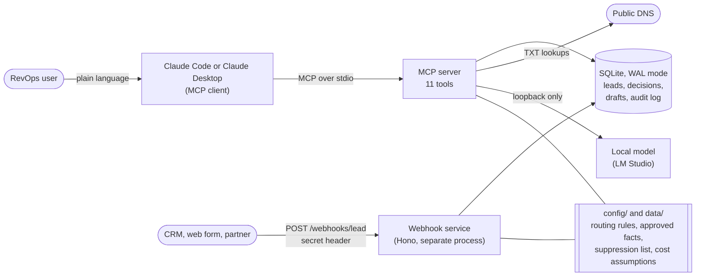
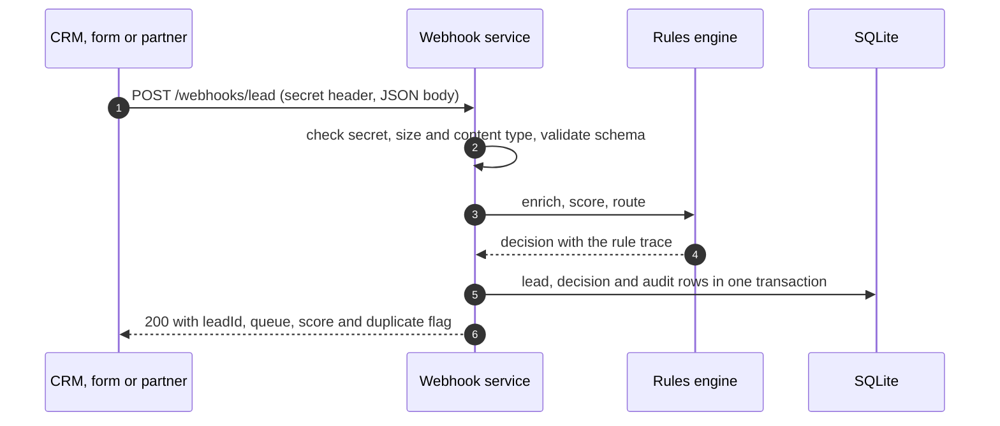
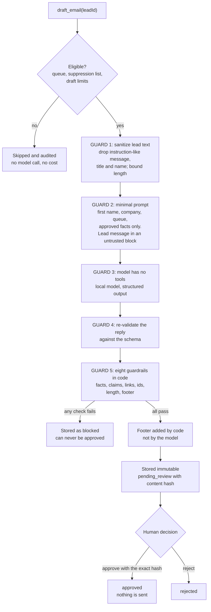
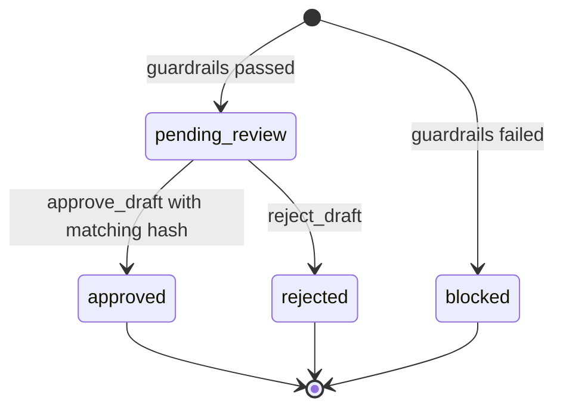

# Architecture

GTM Copilot has **no user interface of its own**. People use it by talking to Claude (Claude Code or Claude Desktop), which calls tools exposed by an MCP server. A second, separate process receives leads over HTTP. Both share one SQLite database.

## Components

| Part | Responsibility | Source |
|---|---|---|
| MCP server | Exposes the 11 tools over stdio; started by the MCP client | `src/index.ts`, `src/server.ts` |
| Webhook service | Authenticates, validates and routes inbound leads; writes the audit trail | `src/webhook.ts`, `src/webhook/` |
| Rules engine | Enrichment (mock), scoring and routing from `config/routing.json`; deterministic, no model | `src/leads/` |
| Drafting pipeline | Eligibility, sanitizing, prompt, model call, guardrails, approval queue | `src/sdr/` |
| Cost model | Build vs buy vs hybrid cost per meeting, from stored usage and labeled assumptions | `src/economics/` |
| SQLite | Leads, decisions, immutable drafts, append-only audit log; shared by both processes | `src/db/` |

The two processes are separate because an MCP stdio server is launched and owned by its client and cannot also host an HTTP port reliably. They find the same database because its default path is anchored to the repository, not the working directory.

## Lead intake

Rejected requests (wrong secret, oversized, wrong content type, invalid fields) are audited without their bodies. A repeated delivery returns the original result and creates nothing new.

## Drafting an email, with the injection defenses marked

Guards 1 and 2 reduce what the model is exposed to. Guards 3 to 5 do not depend on the model behaving: even a model that fully obeys an injected instruction can only produce text, and that text is checked before a human sees it. See [safety.md](safety.md).

## Draft lifecycle

Transitions are enforced by database triggers, not only by application code. Content cannot change after creation, a decision is final, and drafts cannot be deleted.

## Trust boundaries

| Crossing | Data | Treated as | Control |
|---|---|---|---|
| Internet to webhook | JSON body | Hostile | Secret in constant time, 16 KB limit, content type, schema validation, idempotency, bodies never logged |
| Lead text to model | message, title, first name | Hostile | Pattern drop, truncation, untrusted block, no tools, output checked |
| Model to storage | subject, body, cited fact ids | Untrusted | Schema re-validation, guardrails, immutable storage, human approval |
| Server to model | prompt | Sensitive | Loopback-only URL, no email address, no last name |
| Claude to tools | tool calls | An agent acting for the user | Input schemas, approval needs the reviewed hash, client permission prompts |
| Server to audit log | ids, queues, check ids | Must stay clean | Guard that refuses any entry resembling an email; no draft text or lead data |

## Not built (and why)

HubSpot, Salesforce, Clay and Gong integrations are represented by a mock enricher and the SQLite stand-in CRM. The interfaces (`Enricher`, `Drafter`, `DnsResolver`) are where real integrations would plug in. Nothing is ever sent; there is no email transport in this codebase.
